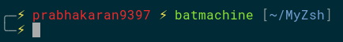
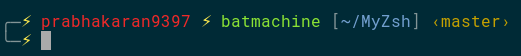

## Custom shell theme
### BASH

```
echo "PS1='╭─\[\033[01;33m\]⚡\[\033[00m\] \[\033[01;31m\]\u\[\033[00m\] \[\033[01;33m\]⚡\[\033[00m\] \[\033[01;32m\]\h\[\033[00m\] [\[\033[01;34m\]\w\[\033[00m\]]\n╰─\[\033[01;33m\]⚡\[\033[00m\] '" >> ~/.bashrc
```



Note: Supports Current directoty view.

### ZSH

`cd ~`

`git clone https://github.com/prabhakaran9397/MyZsh.git`

`cp ~/MyZsh/prabhakaran9397.zsh-theme ~/.oh-my-zsh/themes/`
 
`gedit .zshrc`
 
<p>Change it to ZSH_THEME="prabhakaran9397"</p>



Note: Supports Current directoty view, Git Branch view.
