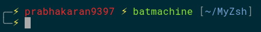
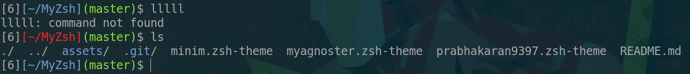
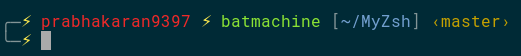
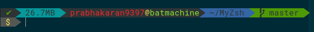

## Custom shell theme
### BASH

```
$ echo "PS1='╭─\[\033[01;33m\]⚡\[\033[00m\] \[\033[01;31m\]\u\[\033[00m\] \[\033[01;33m\]⚡\[\033[00m\] \[\033[01;32m\]\h\[\033[00m\] [\[\033[01;34m\]\w\[\033[00m\]]\n╰─\[\033[01;33m\]⚡\[\033[00m\] '" >> ~/.bashrc
$ source ~/.bashrc
```


Paste the following in [`~/.bashrc`](https://raw.githubusercontent.com/prabhakaran9397/dotfiles/master/bash/.bashrc)
```
PROMPT_COMMAND=my_prompt
my_prompt() {
    local stat=$?
    local red='\[\033[01;31m\]'
    local blu='\[\033[01;34m\]'
    local gre='\[\033[01;32m\]'
    local end='\[\033[00m\]'
    local tty='[$(tty|cut -d/ -f4)]'
    [ $stat = 0 ] && color=$blu || color=$red
    local dir=$color'[\w]'$end
    local git=$gre$(__git_ps1 '(%s)')$end
    local sym='\$'
    PS1="${tty}${dir}${git}${sym} "
}

```


### ZSH

#### If ZSH not installed

`sudo apt-get install zsh`

`chsh -s /bin/zsh`

#### Installing this theme

`cd ~`

`git clone https://github.com/prabhakaran9397/MyZsh.git`

`cp ~/MyZsh/*.zsh-theme ~/.oh-my-zsh/themes/`
 
`gedit .zshrc`
 
##### prabhakaran9397

###### Note: Supports Current directoty view, Git Branch view.

Change it to ZSH_THEME="prabhakaran9397"



##### myagnoster

###### Note: Supports Current directoty view, Git Branch view, was there any error, are there background jobs?, am I root, [Data used (Uploaded+Downloaded)](https://raw.githubusercontent.com/prabhakaran9397/batmachine-scripts/master/datausage).

Change it to ZSH_THEME="myagnoster"


